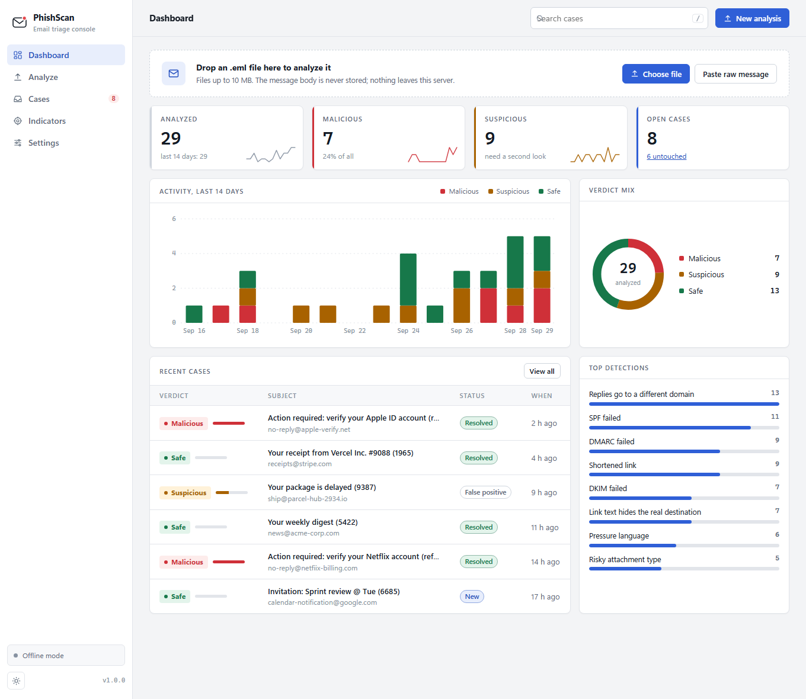
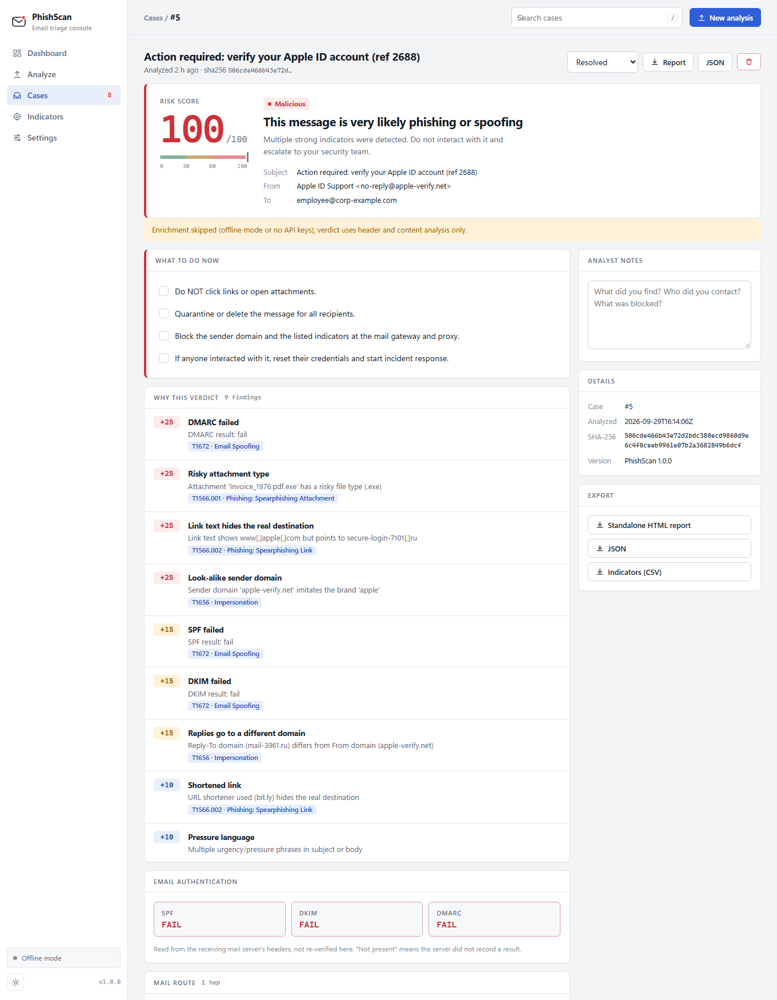

# PhishScan

**Email triage console for phishing.** Drop in a suspicious email and get an explainable verdict, the evidence behind it, a plain "what to do now" checklist and a MITRE ATT&CK mapping. Work the results as cases with statuses and notes, and collect every indicator into one exportable list. It runs as a web console, a command-line tool, or a Docker container.



## Why
Phishing triage is the most repetitive job in a SOC. An analyst spends 10-15 minutes per email reading headers, extracting links and looking things up. PhishScan does that first pass in seconds, and every point of its 0-100 risk score comes with a plain-English reason, so the analyst can trust it or overrule it.



## What it does
| | |
|---|---|
| **Dashboard** | Totals, 14-day activity, verdict mix, top detections, open cases, recent cases. Light and dark themes. |
| **Analyze** | Drag and drop an `.eml`, paste a raw message, or try a built-in sample. |
| **Cases** | Every analysis becomes a case: search, filter by verdict or status, set *New / Investigating / Resolved / False positive*, keep analyst notes, export a standalone report or JSON. |
| **Indicators** | URLs, domains, IPs and hashes across all cases, with how often each was seen. Export a defanged CSV, or raw values for a blocklist. |
| **Settings** | Which lookup services are configured, limits, and the full list of scoring rules. |
| **CLI + API** | `phishscan file.eml`, `phishscan ./folder/`, and a JSON API for scripts. |

## What it checks
| Area | Checks |
|---|---|
| Authentication | SPF / DKIM / DMARC from `Authentication-Results` (falls back to `Received-SPF`), Reply-To and Return-Path alignment (subdomains of the same organization are accepted), display-name spoofing |
| Content | Look-alike sender domains (`paypa1.com`), punycode (`xn--`) domains, a **brand name in the display name sent from another domain**, **link text that lies about its destination**, URL shorteners, raw-IP links, urgency language |
| Attachments | SHA-256, risky types including double extensions (`invoice.pdf.exe`), hidden right-to-left-override tricks in file names, `.html` / `.iso` / `.lnk` / macro documents |
| Mail route | Parsed `Received` chain, oldest hop first, with sender IPs |
| Reputation (optional) | VirusTotal, AbuseIPDB, URLScan. Cached locally and rate limited. "Never seen" is shown as *not seen*, never as clean. |

## Real-world behavior
- Decodes RFC 2047 headers and quoted-printable / base64 bodies, handles HTML-only mail, several `Authentication-Results` headers (topmost wins) and unnamed attachments.
- Truncated or corrupted files never crash it: they are analyzed as far as possible, or rejected with a readable message (covered by a stress test).
- Checked against a realistic credential-phishing email **and** a legitimate newsletter, so it is tested for false alarms as well as detections.
- Lookup failures (bad key, rate limit, no network) never stop a run; they show up as notes in the report. It works fully offline, and with no API keys **nothing leaves your machine**.

## Quick start
```bash
git clone <your-repo-url> && cd phishscan
python -m venv .venv
.venv/Scripts/activate            # Linux/macOS: source .venv/bin/activate
pip install .                     # or: pip install -e ".[dev]" to develop
phishscan serve --demo            # http://127.0.0.1:8000 with sample data (nothing is saved)
phishscan serve                   # your own console; cases are saved to ~/.phishscan/phishscan.db
```

## Command line
```bash
phishscan examples/phishing.eml                 # writes examples/phishing.report.html
phishscan examples/phishing.eml --json --offline
phishscan ./quarantine/                         # whole folder: reports + index.html + summary.csv
```
Exit codes: `0` Safe, `1` Suspicious, `2` Malicious, `3` bad input (in folder mode: the worst verdict found). Standalone reports are single self-contained HTML files with **no JavaScript**, safe to attach to a ticket.

## JSON API
```bash
curl -H "Authorization: Bearer $PHISHSCAN_API_TOKEN" \
     -F "eml=@examples/phishing.eml" http://127.0.0.1:8000/api/analyze
```
`POST /api/analyze` is stateless: it returns the analysis and stores nothing. `GET /api/stats` returns dashboard numbers. `GET /healthz` is public, for load balancers.

## Deploy with Docker
```bash
cp .env.example .env              # set PHISHSCAN_PASSWORD (required) and any API keys
docker compose up --build -d      # http://localhost:8000
```
The container runs as a non-root user with a read-only filesystem and all Linux capabilities dropped, keeps data in a volume, and has a health check. **The server refuses to start on a network address without `PHISHSCAN_PASSWORD`.** Put it behind an HTTPS reverse proxy (Caddy, nginx, a cloud load balancer) and set `PHISHSCAN_TRUST_PROXY=1` and `PHISHSCAN_COOKIE_SECURE=1`.

| Variable | Default | Meaning |
|---|---|---|
| `PHISHSCAN_PASSWORD` | none | Login password. Required on non-localhost addresses. |
| `PHISHSCAN_API_TOKEN` | none | Lets scripts call `/api/*` with a Bearer token when a password is set. |
| `PORT` / `PHISHSCAN_PORT`, `PHISHSCAN_HOST` | `8000`, `127.0.0.1` (`0.0.0.0` in Docker) | Where to listen. |
| `PHISHSCAN_DB` | `~/.phishscan/phishscan.db` (`/data/...` in Docker) | Case database. |
| `PHISHSCAN_MEMORY_ONLY` | off | `1` keeps cases in memory only; nothing is written to disk. |
| `PHISHSCAN_RETENTION_DAYS` | keep forever | Auto-delete cases older than this. |
| `MAX_UPLOAD_MB` | `10` | Upload size limit. |
| `PHISHSCAN_RATE_LIMIT` | `60` | Requests per minute per client IP (logins are limited to 8/min). |
| `PHISHSCAN_OFFLINE` | off | `1` never contacts any reputation service. |
| `VT_API_KEY`, `ABUSEIPDB_API_KEY`, `URLSCAN_API_KEY` | none | Enable that reputation service. |

## How it scores
Each rule counts once and the score is capped at 100. Weights live in one file, [`phishscan/weights.py`](phishscan/weights.py). **0-29 Safe, 30-59 Suspicious, 60+ Malicious.** The full rule table is also on the Settings page.

| Rule | Pts | Rule | Pts |
|---|---|---|---|
| Malicious attachment hash | 50 | Display name shows another address | 20 |
| Link flagged by reputation services | 40 | Brand name in display name, wrong sender | 20 |
| Disguised attachment name (RTL override) | 30 | Look-alike punycode domain | 20 |
| DMARC fail | 25 | Sender IP with abuse history | 20 |
| Look-alike sender domain | 25 | SPF / DKIM fail | 15 each |
| Link text hides real destination | 25 | Replies to another domain, raw-IP link | 15 each |
| Risky attachment type | 25 | No auth header, Return-Path mismatch, shortener, pressure language | 10 each |

## Security
- **Sign-in and CSRF:** optional password login (constant-time compare, rate limited, safe redirects), and a CSRF token on every state-changing request.
- **Strict browser policy:** scripts only from this server, no framing, `nosniff`, `no-store`; all email-derived text is HTML-escaped, and downloaded reports contain no JavaScript at all.
- **Handling hostile email:** attachments are hashed only and never opened; links are never visited; every indicator is defanged (`hxxp://evil[.]com`) on screen. CSV exports are protected against spreadsheet formula injection.
- **Data:** the message body is never stored. A case keeps the analysis result (headers, indicators, verdict) and your notes. With lookups enabled, only indicators (never email text) are sent to the services you configured. See [SECURITY.md](SECURITY.md).

## Architecture
```
.eml -> parser --> auth checks ----------------\
             \--> extractor (IOCs) --> heuristics --> scorer --> report context --> dashboard / standalone HTML / JSON
                        \--> enrichment (VT / AbuseIPDB / URLScan, cached) --/                    |
                                                                                       store (SQLite cases, IOCs)
```
One small module per job in `phishscan/` (`parser`, `auth`, `extractor`, `heuristics`, `enrich/`, `scorer`, `report`, `store`, `viz`, `web`, `cli`), each with tests in `tests/`. Charts are drawn server-side as SVG, so there is no chart library and no build step.

## Development
```bash
pip install -e ".[dev]"
python -m pytest -q                 # no internet or API keys needed
python -m examples.make_examples    # regenerate the sample emails and reports
phishscan serve --demo              # try the console with generated data
```
CI (`.github/workflows/ci.yml`) runs the tests on Python 3.10-3.13, then builds the Docker image, checks that it refuses to start without a password, and smoke-tests the running container.

## Limitations
- Weights are heuristics; tune them against your own mail flow.
- SPF/DKIM/DMARC results come from your mail server's headers and are not re-verified.
- Legitimate marketing email sometimes shows a different tracking domain in its links, which can trigger the link-text rule. It alone is never enough for a Malicious verdict.
- The link-text check compares the last two domain labels, so it can miss cases inside suffixes such as `co.uk`.
- No QR-code (image) analysis and no `.msg` files yet; export as `.eml`.
- URLScan results use its public search API and may need adjusting against live data.
- Automated triage aid: a human analyst should confirm the verdict before acting.

## Roadmap
`.msg` support, YARA scanning of attachments, quarantine-mailbox (IMAP) polling, MISP / TheHive export, per-user accounts.

## License
MIT. See [LICENSE](LICENSE).
