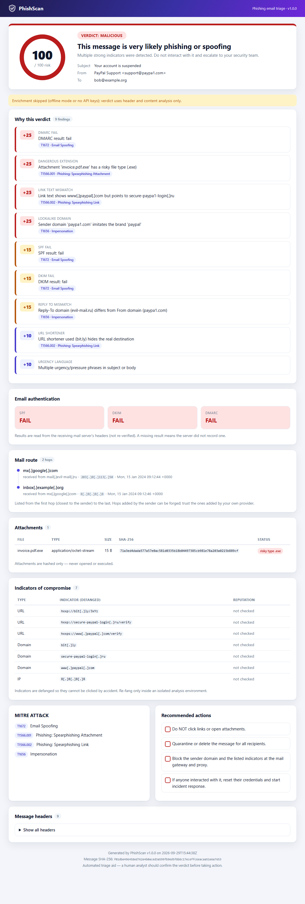
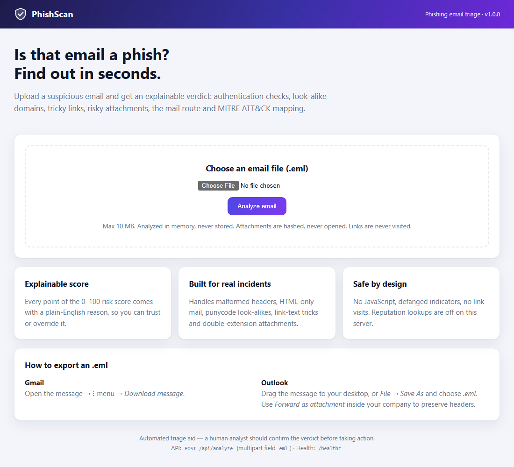

# PhishScan

**Automated phishing email triage.** Drop in a suspicious `.eml` and get an *explainable* verdict (Safe / Suspicious / Malicious), the evidence behind it, a clean report and a MITRE ATT&CK mapping. Use it from the command line, on a whole folder of emails, or as a small web app you can deploy.



## Why
Phishing triage is the most repetitive job in a SOC. An analyst spends roughly 10-15 minutes per email reading headers, extracting links and looking things up. PhishScan does that first pass in seconds, and every point in its 0-100 risk score comes with a plain-English reason, so the analyst can trust it or overrule it.

## What it checks
| Area | Checks |
|---|---|
| Authentication | SPF / DKIM / DMARC from `Authentication-Results` (falls back to `Received-SPF`), Reply-To and Return-Path domain alignment (subdomains of the same organization are accepted), display-name spoofing |
| Content | Look-alike sender domains (`paypa1.com`, `paypal-secure.com`), punycode (`xn--`) domains, **link text that lies about its destination**, URL shorteners, raw-IP links, urgency language |
| Attachments | SHA-256, risky types including double extensions (`invoice.pdf.exe`), `.html` / `.iso` / `.lnk` / macro documents |
| Mail route | Parsed `Received` chain, oldest hop first, with sender IPs |
| Reputation (optional) | VirusTotal, AbuseIPDB, URLScan; cached locally, rate-limited (VirusTotal free tier: 4 requests/min) |
| Reporting | HTML report, JSON export, MITRE ATT&CK techniques, recommended response actions, SHA-256 of the message itself for your case notes |

## Real-world behavior
- Decodes RFC 2047 headers and quoted-printable / base64 bodies, handles HTML-only mail, multiple `Authentication-Results` headers (topmost wins), unnamed attachments and nested messages.
- Truncated or corrupted files never crash it: they are analyzed as far as possible, or rejected with a readable message. Covered by a stress test in `tests/test_realistic.py`.
- Tested against a realistic credential-phishing email **and** a legitimate newsletter, so it is checked for false alarms as well as detections.
- Enrichment failures (bad key, rate limit, network down) never stop a run; they are shown as notes in the report. It works fully offline.

## Install
```bash
git clone <your-repo-url> && cd phishscan
python -m venv .venv
.venv/Scripts/activate            # Linux/macOS: source .venv/bin/activate
pip install .                     # or: pip install -e ".[dev]" to develop
cp .env.example .env              # optional: add free API keys
```
Free keys: [VirusTotal](https://www.virustotal.com), [AbuseIPDB](https://www.abuseipdb.com), [URLScan](https://urlscan.io). All optional.

## Command line
```bash
phishscan examples/phishing.eml                 # writes examples/phishing.report.html
phishscan examples/phishing.eml --json --offline
phishscan ./quarantine/                         # whole folder: reports + index.html + summary.csv
phishscan --help
```
Exit codes make it easy to script: `0` Safe, `1` Suspicious, `2` Malicious, `3` bad input. In folder mode the exit code is the worst verdict found.

```
Verdict: Malicious (score 100/100)
  +25  DMARC result: fail
  +25  Attachment 'invoice.pdf.exe' has a risky file type (.exe)
  +25  Link text shows www[.]paypal[.]com but points to secure-paypa1-login[.]ru
  ...
```

## Web app
```bash
phishscan serve                  # http://127.0.0.1:8000
phishscan serve --host 0.0.0.0 --port 8000
```


| Endpoint | Purpose |
|---|---|
| `GET /` | Upload page |
| `POST /analyze` | Upload (`eml` form field) → HTML report |
| `POST /api/analyze` | Same, returns JSON. Also accepts a raw body (`Content-Type: message/rfc822`) |
| `GET /healthz` | Health check for load balancers |

```bash
curl -F "eml=@examples/phishing.eml" http://127.0.0.1:8000/api/analyze
```
Emails are analyzed **in memory and never written to disk**. Upload size is capped (`MAX_UPLOAD_MB`, default 10) and each client IP is rate limited. Reputation lookups turn on only if you configure API keys.

## Deploy with Docker
```bash
docker compose up --build -d     # http://localhost:8000
```
The image runs as a non-root user with a read-only filesystem, all Linux capabilities dropped, and a health check. Put it behind an HTTPS reverse proxy (Caddy, nginx, a cloud load balancer) and set `PHISHSCAN_TRUST_PROXY=1` so rate limiting sees real client IPs.

| Variable | Default | Meaning |
|---|---|---|
| `PORT` / `PHISHSCAN_PORT` | `8000` | Listen port (`PORT` is honored by most PaaS hosts) |
| `PHISHSCAN_HOST` | `127.0.0.1` (`0.0.0.0` in Docker) | Listen address |
| `MAX_UPLOAD_MB` | `10` | Max upload size |
| `PHISHSCAN_RATE_LIMIT` | `30` | Uploads per minute per client IP |
| `PHISHSCAN_OFFLINE` | off | `1` disables all outbound lookups |
| `PHISHSCAN_TRUST_PROXY` | off | `1` when behind a reverse proxy |
| `PHISHSCAN_CACHE_DIR` | `~/.phishscan` | Where lookup results are cached (indicators only, never email content) |
| `VT_API_KEY`, `ABUSEIPDB_API_KEY`, `URLSCAN_API_KEY` | none | Enable reputation lookups |

**Public deployment note:** the web app has no login. If you expose it to the internet, put authentication in front of it (reverse-proxy basic auth, an SSO gateway, or a private network), because uploaded emails may be sensitive and lookups spend your API quota.

## How it scores
Each rule counts once, the score is capped at 100, and all weights live in [`phishscan/weights.py`](phishscan/weights.py). **0-29 Safe, 30-59 Suspicious, 60+ Malicious.**

| Rule | Pts | Rule | Pts |
|---|---|---|---|
| Malicious attachment hash | 50 | Display-name spoof | 20 |
| URL flagged by reputation engines | 40 | Punycode domain | 20 |
| DMARC fail | 25 | IP with high abuse score | 20 |
| Look-alike sender domain | 25 | SPF / DKIM fail | 15 each |
| Link text ≠ destination | 25 | Reply-To mismatch, raw-IP link | 15 each |
| Risky attachment type | 25 | Missing auth header, Return-Path mismatch, shortener, urgency | 10 each |

## Safety
- Attachments are **hashed only**, never opened or executed. Links are **never visited**.
- Every indicator is **defanged** (`hxxp://evil[.]com`) in reports and console output.
- Reports contain **no JavaScript**, and all email-derived text is HTML-escaped. The web app sends a strict Content-Security-Policy, `X-Frame-Options: DENY`, `nosniff` and `no-store`.
- API keys come from the environment or a git-ignored `.env`.
- Reputation lookups send indicators (URL, domain, IP, file hash) to the providers you enabled. Leave the keys out (or use `--offline`) for emails you cannot share with third parties. See [SECURITY.md](SECURITY.md).

## Architecture
```
.eml -> parser --> auth checks ----------------\
             \--> extractor (IOCs) --> heuristics --> scorer --> report (HTML / JSON)
                        \--> enrichment (VT / AbuseIPDB / URLScan, cached) --/
CLI (single file, folder) and Flask web app both call analyze_bytes()
```
`phishscan/` holds one small module per job (`parser`, `auth`, `extractor`, `heuristics`, `enrich/`, `scorer`, `report`, `cli`, `web`), each with tests in `tests/`.

## Development
```bash
pip install -e ".[dev]"
python -m pytest -q              # no internet or API keys needed
python -m examples.make_examples # regenerate the sample emails and reports
```
CI (`.github/workflows/ci.yml`) runs the tests on Python 3.10-3.13, then builds the Docker image and smoke-tests the running container.

## Limitations
- Weights are heuristics; tune them against your own mail flow.
- SPF/DKIM/DMARC results are read from your mail server's headers, not re-verified.
- The link-text check compares the last two domain labels, so it can miss mismatches within multi-part suffixes such as `co.uk`.
- `.msg` files are not supported yet; export as `.eml`.
- URLScan results use the public search API and may need adjusting against live data.
- Automated triage aid: a human analyst should confirm the verdict before acting.

## Roadmap
`.msg` support, YARA scan of attachments, quarantine-mailbox (IMAP) polling, MISP / TheHive export, and optional API-key authentication for the web app.

## License
MIT. See [LICENSE](LICENSE).
